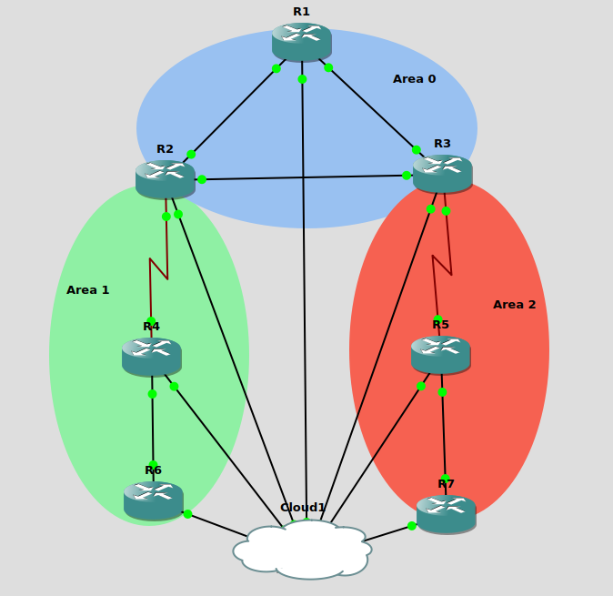

# OSPF Network Automation Lab with Ansible

This project is a **training-focused** lab for configuring and troubleshooting Cisco routers using **Ansible**. It is deployed in **GNS3**, allowing for hands-on practice with dynamic configurations, routing protocols, and network automation. 

## 📌 Project Scope

The primary objective is to automate the configuration and troubleshooting of **OSPF, BGP**, and other networking functionalities using **Ansible**. The project serves as a training environment for:
- Automating **IP configuration** on Cisco routers.
- Configuring and troubleshooting **OSPF** multi-area.
- Deploying **BGP** configurations (future).
- Enhancing **network automation skills** with Ansible.

## 🏗️ Topology

The lab is designed with a **multi-area OSPF** topology in **GNS3**, as shown below:



- **Area 0 (Backbone)**: R1, R2, R3
- **Area 1**: R2, R4, R6
- **Area 2**: R3, R5, R7
- **Cloud**: Represents a management network for configurations.

## 🔧 Setup & Installation

1. Install **GNS3** and configure the routers with **Cisco IOS (C7200-ADVENTERPRISEK9-M)**.
2. Install **Ansible**:
   ```bash
   sudo apt update && sudo apt install ansible -y
   ```
3. Clone this repository:
   ```bash
   git clone https://github.com/yourusername/OSPF-BGP-automation-lab.git
   ```
4. Navigate to the project directory:
   ```bash
   cd OSPF_Troubleshooter_Ansible
   ```
5. Update your **inventory.yml** file with the correct router IPs.

## 🚀 Running the Playbooks

### 1️⃣ Configure IPs on Routers
```bash
ansible-playbook -i inventory.yml playbooks/configure_ips.yml
```

### 2️⃣ Verify IP Configuration
```bash
ansible-playbook -i inventory.yml playbooks/debug_ips.yml
```

### 3️⃣ Configure OSPF
```bash
ansible-playbook -i inventory.yml playbooks/configure_ospf.yml
```

## 🔒 Security Considerations
- For security, store passwords encrypted with **Ansible Vault**.

## 🚀 Future Improvements
- ✅ Automate **BGP** configuration.
- ✅ Implement **troubleshooting playbooks** for OSPF & BGP.
- ✅ Add **automated rollback** for incorrect configurations.
- ✅ Integrate with **NetBox** for network inventory management.
- ✅ Expand with **real-time monitoring** using Ansible.

---

💡 **This project is for learning purposes and is continuously evolving.** Feel free to contribute or suggest improvements!

📧 **Contact:** [danyurru92@example.com]
